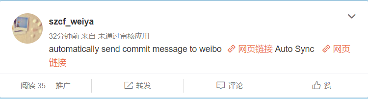

# GitRadio-kernel
Sina App for automatically sending commit messages to sina and write new weibo.

`GitRadio`是一款新浪应用，用于将commit message同步到新浪微博中。举个例子，对于我的仓库`ESL-CN`，按如下命令将本地的修改提交到Github

```bash
git add .
git commit -m "automatically send commit message to weibo"
git push origin master
```

此时我会自动在新浪网发出一条微博


